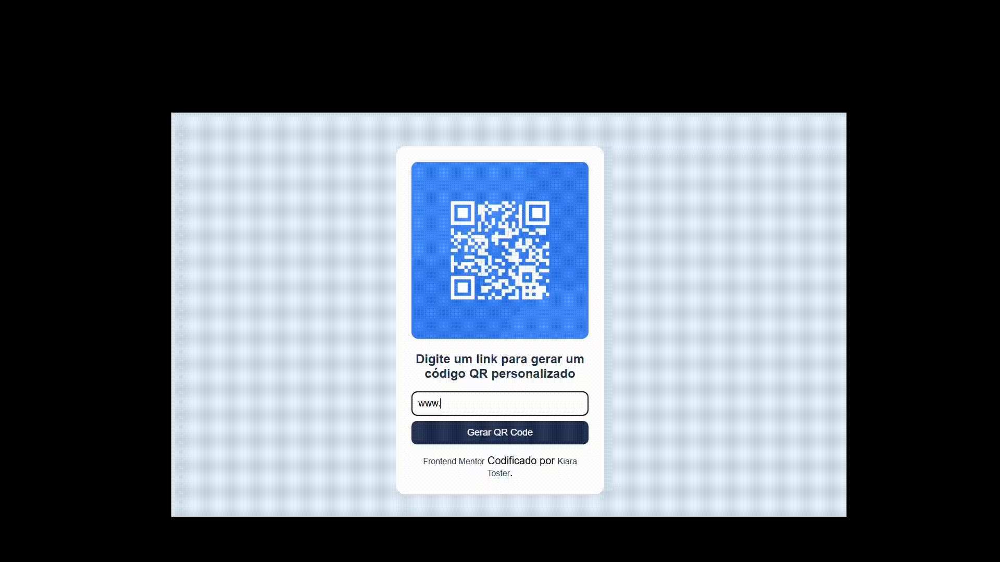

# 🔳 QR Code Generator

Aplicação web que permite gerar QR Codes de forma rápida e prática a partir de textos ou links, com atualização em tempo real.

---

## 🚀 Funcionalidades

* 🔗 Gerar QR Code a partir de URLs ou textos
* ⚡ Atualização em tempo real
* 📱 Interface simples e responsiva
* 🎯 Experiência de uso intuitiva

## 🛠️ Tecnologias utilizadas

  
  
  

## 📸 Preview

## 🌐 Acesse o projeto

 Repositório: https://github.com/kiaraengineer-dev/qr-code-generator

